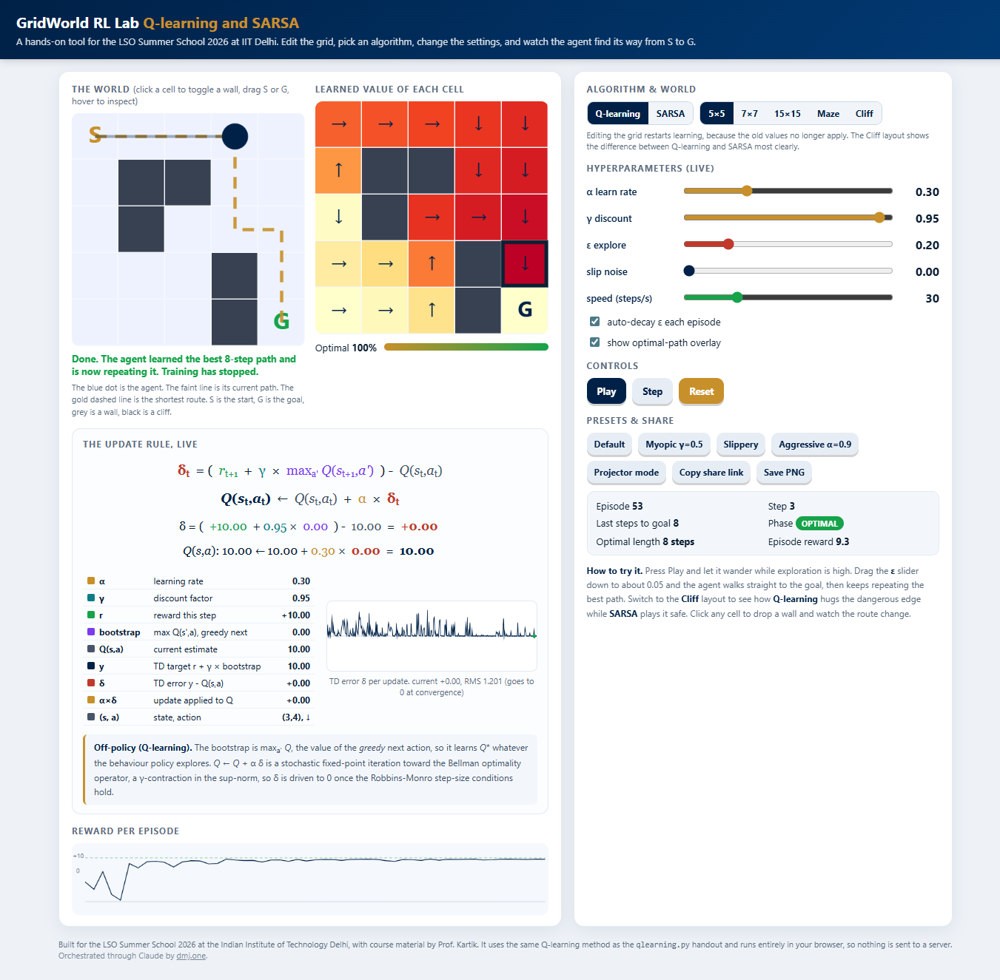

# GridWorld RL Lab

[](https://github.com/divyamohan1993/gridworld-rl-lab/actions/workflows/ci.yml)
&nbsp;**Live demo: [gridworld.dmj.one](https://gridworld.dmj.one)**

A hands-on tool for learning **Q-learning** and **SARSA** on a gridworld. Edit the grid, change the
settings, and watch the agent work out the shortest path from start (S) to goal (G). Built for the
LSO Summer School 2026 at the Indian Institute of Technology Delhi, with course material by Prof. Kartik.

It runs entirely in the browser. There is no build step and no server, so nothing you do leaves your machine.



## What you can do

- Switch between **Q-learning** and **SARSA** and see how their policies differ.
- Tune the hyperparameters live: learning rate, discount, exploration, slip noise, and speed.
- **Edit the world**: click a cell to add or remove a wall, drag S or G to move them.
- **Inspect** any cell by hovering to see its four action values.
- Watch the **optimal path overlay** and a live "percent optimal" gauge.
- Study the **update rule live**: the TD equation with each term colour coded and filled with the
  current numbers, a legend of every term's value, and a TD-error trace that converges to zero. The
  bootstrap term and the note switch between the off-policy (Q-learning) and on-policy (SARSA) forms.
- Try preset grids: 5x5, 7x7, 15x15, a maze, and a cliff. The cliff layout shows the
  Q-learning vs SARSA difference most clearly.
- Save a snapshot, copy a share link that encodes your settings, or switch on projector mode.

## Run it locally

No dependencies. Serve the folder with any static server:

```bash
python -m http.server 8000
# then open http://localhost:8000
```

## Tests

```bash
node ql_core.test.js   # checks the learning core converges to the known optimal 8-step path
node ci/checks.js      # checks the page parses and stays free of stray writing marks
```

## Continuous integration and deployment

- **CI**: GitHub Actions runs the tests above on every push and pull request (`.github/workflows/ci.yml`).
- **CD**: the repository is connected to Vercel, which builds and deploys a fresh version on every
  push to `main`. Pull requests get their own preview deployments.

## Files

| File | Purpose |
| --- | --- |
| `index.html` | The whole app: markup, styles, and logic in one file, no external requests. |
| `ql_core.test.js` | Node test for the Q-learning core. |
| `ci/checks.js` | Syntax and writing checks for CI. |
| `vercel.json` | Security headers and routing for the Vercel deployment. |
| `ci/checks.js` | Static checks (parse the page, keep the prose clean). |
| `LICENSE` | MIT license for the application code. |

## License

The application code is released under the MIT License, see [LICENSE](LICENSE). The course and
teaching material are credited to Prof. Kartik and the LSO Summer School 2026 at IIT Delhi.

Orchestrated through Claude by [dmj.one](https://dmj.one).
